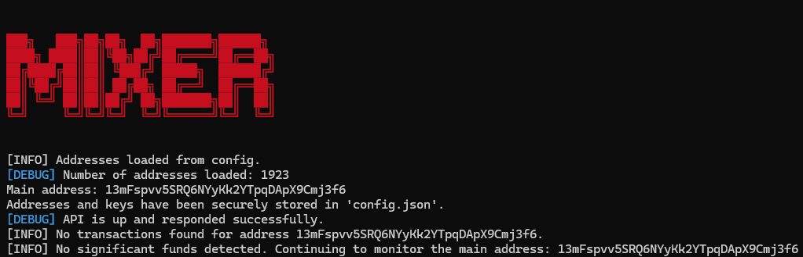

# Bitcoin Mixer

Bitcoin Mixer is a robust solution designed to enhance the privacy and anonymity of your Bitcoin transactions. By utilizing advanced cryptographic techniques, this mixer effectively obfuscates transaction trails, making your financial activities untraceable.

## Key Features
- **Untraceable Transactions**: Breaks the link between your sending and receiving addresses, ensuring that your transactions cannot be traced back to you.
- **Enhanced Privacy**: Combines funds from multiple users, creating a pool that enhances anonymity and protects your financial identity.
- **Secure Mixing Process**: Employs advanced algorithms to ensure the highest level of security during the mixing process.
- **User-Friendly Interface**: Designed for ease of use, making it accessible for both experienced and novice users.
- **Custom delay**: Uses custom delay so your transactions and mixes will become harder to trace and predict.
## Benefits
- **Protect Your Identity**: Safeguard your financial activities from surveillance and tracking by third parties.
- **Freedom to Transact**: Enjoy peace of mind knowing that your Bitcoin transactions are private and secure.

## Contact
For inquiries and access to the Bitcoin Mixer, please contact me at [0day@yin.sh] or on [Telegram](t.me/undecryptable).

---
